# Team Bismuth


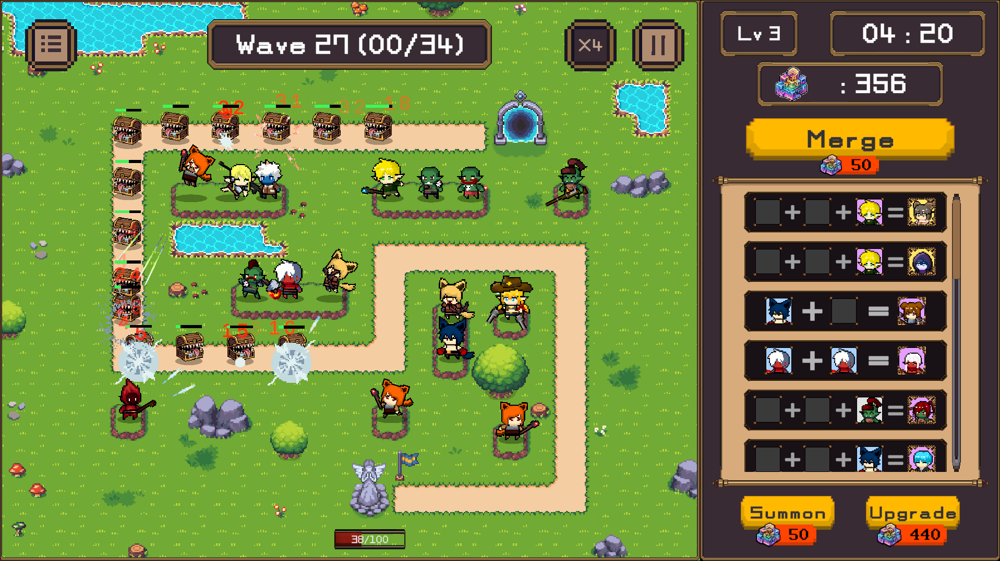

---

## 📑 목차

- [프로젝트 소개](#프로젝트-소개)
- [핵심 컨셉](#핵심-컨셉)
- [게임 목표](#게임-목표)
- [플레이 흐름](#플레이-흐름)
- [주요 시스템](#주요-시스템)
- [기획 의도](#기획-의도)
- [타겟 유저](#타겟-유저)
- [차별 포인트](#차별-포인트)
- [기대 플레이 경험](#기대-플레이-경험)
- [비주얼 및 화면 구성](#비주얼-및-화면-구성)
- [팀 프로젝트 방향](#팀-프로젝트-방향)
- [담당 업무](#담당-업무)
  - [UI](#1-ui)
  - [로컬라이징](#2-로컬라이징)
- [시연 영상](#시연-영상)
- [한 줄 소개](#한-줄-소개)

---

## 프로젝트 소개

본 프로젝트는 유닛을 소환하고, 배치하고, 합성하며 점점 강해지는 적의 웨이브를 막아내는 전략형 디펜스 게임이다.  
플레이어는 제한된 자원 안에서 어떤 유닛을 소환할지, 어떤 유닛을 남길지, 어떤 조합을 먼저 완성할지 선택해야 한다.  
전투는 단순한 배치로 끝나지 않고, 소환과 합성을 통한 운영 판단이 핵심이 되는 구조를 목표로 한다.

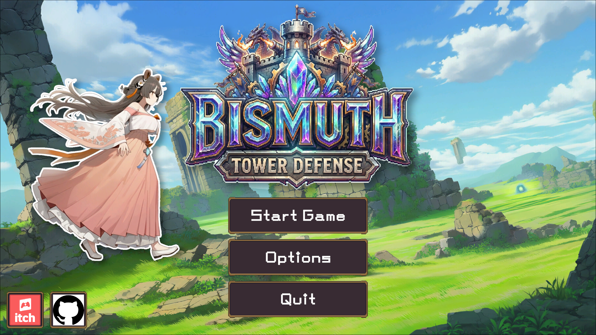

---

## 핵심 컨셉

- **소환의 랜덤성**
  - 원하는 유닛만 바로 얻을 수 없기 때문에 매 판 다른 전개가 발생한다.

- **합성의 계획성**
  - 보유한 유닛을 어떤 타이밍에 조합할지 판단하는 전략이 중요하다.

- **웨이브 기반 전투**
  - 시간이 지날수록 강해지는 적에 맞춰 전력을 계속 재구성해야 한다.

- **선택 중심 운영**
  - 즉시 전투력을 올릴지, 더 높은 가치의 합성을 위해 재료를 남길지 선택하게 된다.


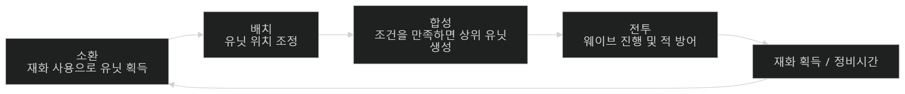

---

## 게임 목표

플레이어는 웨이브마다 등장하는 적을 막아내며 전투를 지속해야 한다.  
전투 중 획득한 자원을 활용해 유닛을 소환하고, 필요한 조합을 완성해 더 강한 유닛으로 성장시킨다.  
궁극적으로는 제한된 자원 안에서 최적의 선택을 반복하여 더 오래 버티고, 더 높은 전투 효율을 만들어내는 것이 목표이다.

---

## 플레이 흐름

1. 전투 시작 전 또는 진행 중 자원을 확보한다.  
2. 자원을 사용해 유닛을 소환한다.  
3. 소환한 유닛을 현재 상황에 맞게 운용한다.  
4. 특정 조합 조건이 충족되면 상위 유닛으로 합성한다.  
5. 웨이브를 막아내며 다음 전투를 준비한다.  
6. 더 강한 적에 맞춰 조합과 운영 방식을 계속 수정한다.

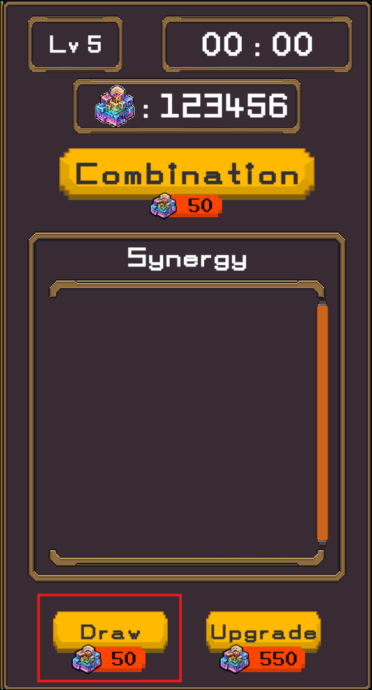


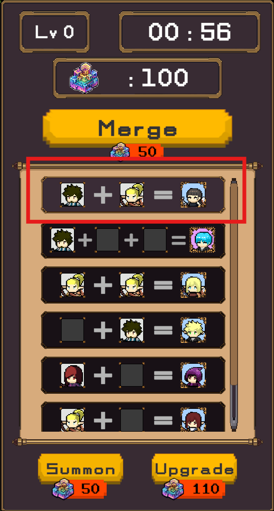
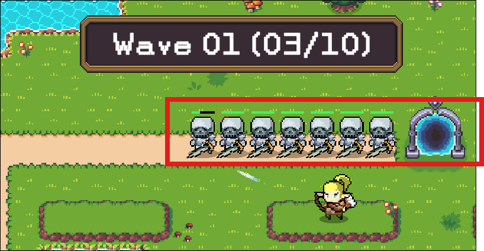

---

## 주요 시스템

### 1. 유닛 소환 시스템
플레이어는 자원을 사용해 유닛을 획득한다.  
소환은 현재 전력을 보강하는 수단이면서 동시에 이후 합성을 위한 재료를 모으는 과정이기도 하다.  
어떤 유닛이 등장하느냐에 따라 이번 전투의 운영 방향이 달라질 수 있다.

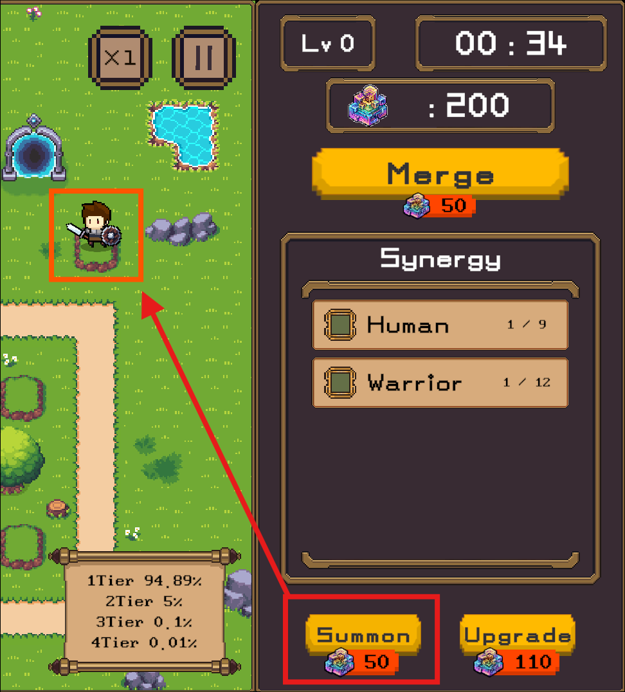

### 2. 유닛 합성 시스템
특정 재료 유닛 조합을 만족하면 상위 유닛으로 합성할 수 있다.  
합성은 단순 수치 상승이 아니라 전투 흐름을 크게 바꾸는 핵심 성장 수단이다.  
플레이어는 현재 전투를 안정화할지, 더 높은 단계의 조합을 노릴지 선택해야 한다.

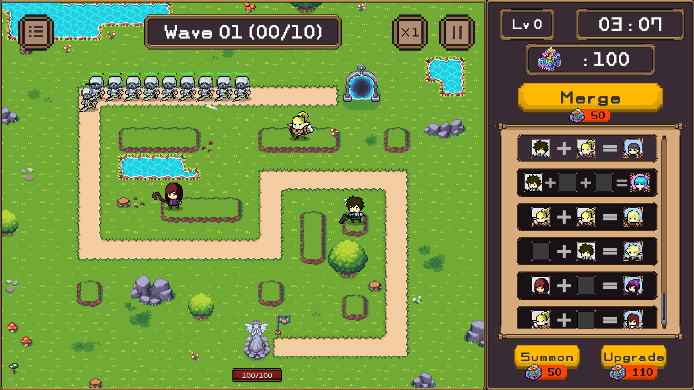
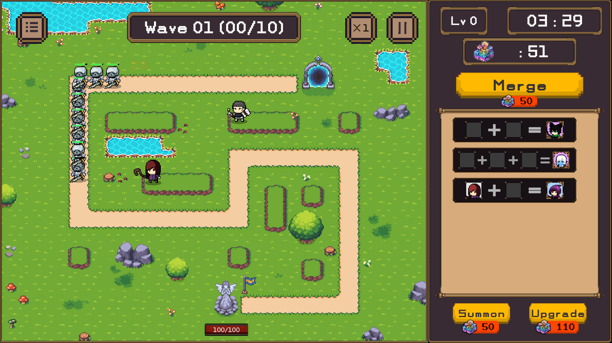

### 3. 웨이브 전투 시스템
전투는 웨이브 단위로 진행되며, 시간이 흐를수록 적의 압박이 강해진다.  
초반에는 기본 유닛 운용만으로 대응할 수 있지만, 후반으로 갈수록 조합과 성장 판단이 중요해진다.  
이 시스템은 단순 유지가 아니라 지속적인 판단과 전력 재정비를 요구한다.


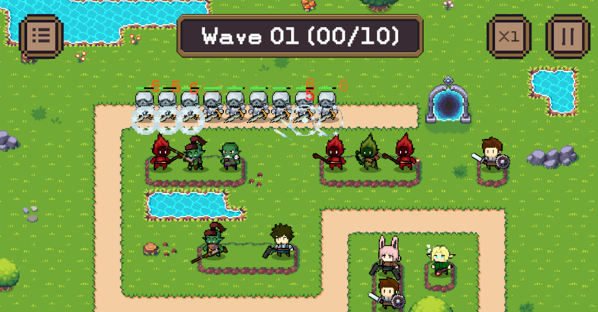

### 4. 전략 운영 요소
이 게임의 핵심은 강한 유닛을 많이 모으는 것이 아니라, 현재 상황에 맞는 선택을 하는 것이다.  
같은 재료를 사용하더라도 언제 합성하느냐에 따라 결과가 달라진다.  
즉시 전력 강화와 미래 성장 준비 사이의 판단이 전투의 깊이를 만든다.

---

## 기획 의도

본 프로젝트는 "운에 따라 달라지는 전개"와 "판단에 따라 달라지는 결과"를 동시에 제공하는 것을 목표로 한다.  
소환은 변수로 작동하고, 합성은 그 변수를 플레이어의 선택으로 바꾸는 장치가 된다.  
이를 통해 매 판 다른 흐름을 제공하면서도, 플레이어의 운영 능력이 분명하게 드러나는 게임 경험을 만들고자 했다.

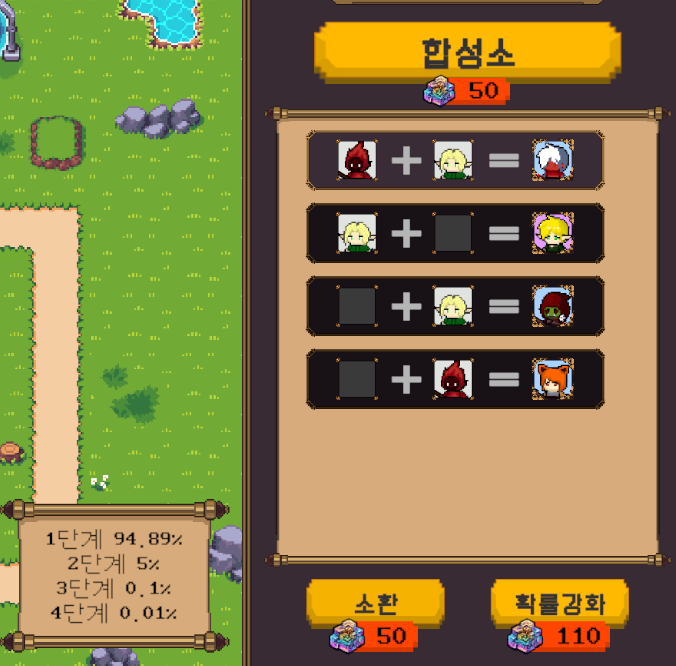

---

## 타겟 유저

- 디펜스 장르를 선호하는 플레이어
- 짧은 판단이 반복되는 전략 플레이를 좋아하는 플레이어
- 조합과 성장 구조를 연구하는 재미를 원하는 플레이어
- 반복 플레이 속에서 다른 전개를 경험하고 싶은 플레이어

---

## 차별 포인트

- 소환과 합성이 하나의 전투 흐름 안에서 자연스럽게 연결된다.
- 단순 배치형 디펜스가 아니라, 운영 선택 자체가 핵심 플레이가 된다.
- 전투 도중에도 조합 가치와 자원 사용 우선순위를 계속 고민하게 만든다.
- 매 판 동일한 정답이 아니라, 상황에 따라 최선의 선택이 달라지는 구조를 지향한다.

---

## 기대 플레이 경험

플레이어는 단순히 적을 막는 것이 아니라, 현재 가진 자원과 유닛으로 최선의 판단을 반복하게 된다.  
합성 성공으로 전세를 뒤집는 순간, 애매한 조합을 버티며 다음 웨이브를 넘기는 순간이 이 게임의 핵심 재미가 된다.  
반복 플레이를 통해 새로운 조합과 운영 방식을 찾는 재미도 기대할 수 있다.

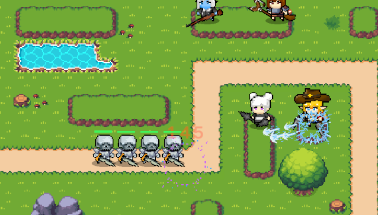

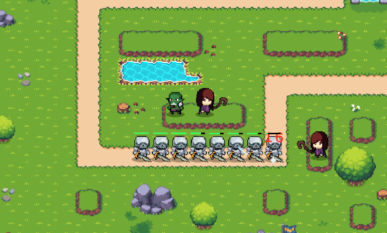

---

## 비주얼 및 화면 구성

게임 화면은 전투 상황을 빠르게 파악할 수 있도록 직관적인 구조를 목표로 한다.  
유닛 상태, 자원, 소환 관련 정보, 전투 상황이 한 화면 안에서 자연스럽게 읽히는 구성을 지향한다.  
합성 가능 여부와 현재 전력 상태가 플레이어에게 명확하게 전달되는 것이 중요하다.

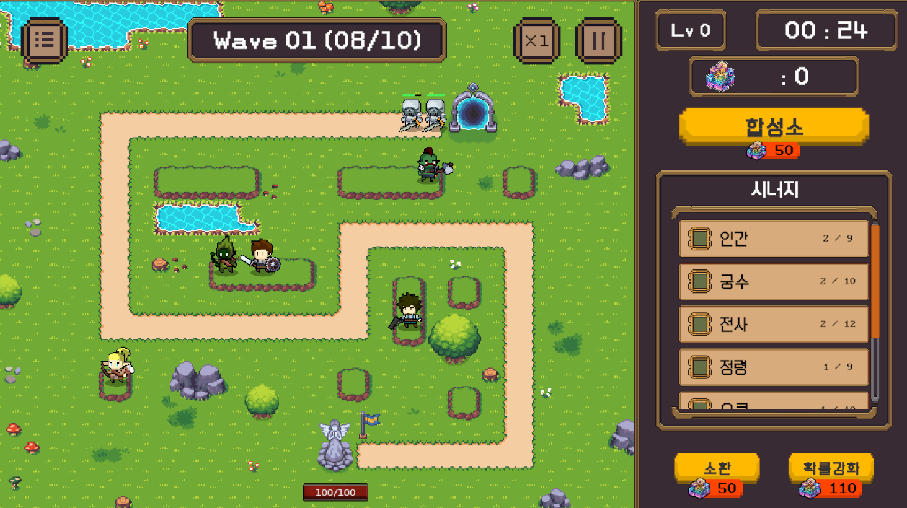


---

## 팀 프로젝트 방향

본 프로젝트는 기획, 전투 시스템, UI, 데이터 작업이 하나의 플레이 흐름 안에서 연결되도록 구성하는 것을 목표로 한다.  
각 파트는 분리되어 작업하되, 최종적으로는 소환-합성-전투가 하나의 경험으로 이어져야 한다.  
따라서 개별 기능 구현보다 전체 플레이 흐름의 완성도를 우선하는 방향으로 진행한다.

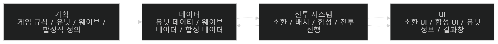

---

## 담당 업무
### 1. UI

**1-1.** **구현 목표**

- 플레이어가 유닛 정보, 시너지, 소환 확률, 조합 가능 여부 등 게임 상태와 필요한 정보를 직관적으로 확인할 수 있어야 했다.

**1-2. 구현 방법**

- **역할 분리**
    - UI와 로직의 역할을 분리하여 UI는 표시 역할에 집중하고, 데이터 처리 및 상태 관리는 별도의 클래스에서 담당하도록 구성하였다.
- **기능 단위 UI 구성**
    - 시너지, 소환 확률, 조합 등 기능별로 UI 클래스를 분리하여 관리하도록 구성하였다.
- **이벤트 기반 갱신**
    - 이벤트 기반으로 갱신되도록 구현하여 상태 변경 시 자동으로 반영되도록 하였다.

**1-3. 설계 의도**

- UI가 게임 데이터를 직접 처리하기보다는 필요한 정보를 받아 표현하는 역할에 집중하도록 하고, 이를 통해 기능별 책임을 분리하여 수정이나 확장 시 영향 범위를 줄이고자 하였다.
- UI를 직접 호출하지 않아도 상태 변화에 따라 자동으로 반영되도록 이벤트 방식을 선택하였다.

**1-4. 결과**

- UI와 로직을 분리함으로써 유지보수성이 향상되었다.

**1-5. 회고**

- UI 모든 부분에 이벤트 기반 갱신을 적용하지 못해 전체적으로 일관된 구조를 구성하지 못한 점이 아쉬웠다.
- MVP 패턴을 적용하고자 하였으나, 협업 과정에서 각자의 코드 구조에 맞추다 보니 완전한 형태로 구현하지 못한 점이 아쉬웠다. 이후에는 역할을 명확히 나누어 보다 완전한 형태의 구조를 적용해보고싶다.

<br>

### 2. 로컬라이징

**2-1. 구현 목표**

- 게임 내 모든 텍스트를 언어에 따라 변경할 수 있어야 했다.

**2-2. 구현 방법**

- **데이터 관리**
    - 언어 데이터를 Google Sheets 기반으로 관리하였다.
    - 각 문자열을 Key - Language 구조로 구성되게 하였다.
        
        
        | Key | Korean | English | Japanese |
        | --- | --- | --- | --- |
        | START_GAME | 게임 시작 | Start Game | ゲームスタート |
        | QUIT | 게임 종료 | Quit | ゲーム終了 |
- **데이터 로드 및 파싱**
    - 시트 데이터를 문자열 배열로 파싱하였다.
    - `Dictionary<string, string>` 형태로 저장되게 구현하였다.
        
        ```csharp
        _table[key] = value;
        ```
        
- **텍스트 조회**
    - Key 기반으로 현재 언어에 맞는 텍스트 조회하는 방식으로 구현하였다.
        
        ```csharp
        LocalizationManager.Instance.Get("START_GAME");
        ```
        
- **Singleton 기반 구조**
    - 전역에서 접근 가능하도록 `Singleton` 패턴을 적용하였다.
- **이벤트 기반 갱신**
    - 언어 변경 또는 데이터 로드 완료 시 이벤트 발생하도록 하였다.
        
        ```csharp
        OnLocalizationLoaded?.Invoke();
        ```

**2-3. 설계 의도**

- 언어 데이터를 Google Sheets 기반으로 관리하여, 기획자가 손쉽게 수정할 수 있도록 하였다.
- Key → Value 구조에서 조회 속도가 빠른 `Dictionary`를 활용하여, 효율적인 데이터 접근이 가능하도록 설계하였다.
- UI 전반에서 공통적으로 사용되는 시스템이기 때문에 별도의 참조 전달 없이 접근할 수 있도록 `Singleton` 패턴을 적용하였다.
- 언어 변경 시 모든 UI를 개별적으로 갱신하는 것은 비효율적이므로 Update가 아닌 이벤트 기반으로 텍스트가 자동 갱신되도록 하였다.

**2-4. 결과**

- 텍스트 수정 시 코드 수정 없이 데이터만 변경하면 반영되는 구조가 되었다.
- 이벤트 기반 자동 갱신 방식으로 개발 편의성과 안정성이 향상되었다.

**2-5. 회고**

- 이번 프로젝트에서는 Dictionary 기반의 로컬라이징 시스템을 구현하였지만, 향후에는 Unity Localization 패키지를 활용하여 보다 체계적이고 확장성 있는 구조를 적용해보고 싶다.

---

## 시연 영상
[](https://www.youtube.com/watch?v=J4G7q7JX6Ek)

---

## 한 줄 소개

유닛을 소환하고, 조합하고, 배치하며 점점 강해지는 적의 웨이브를 막아내는 전략형 디펜스 팀 프로젝트이다.
